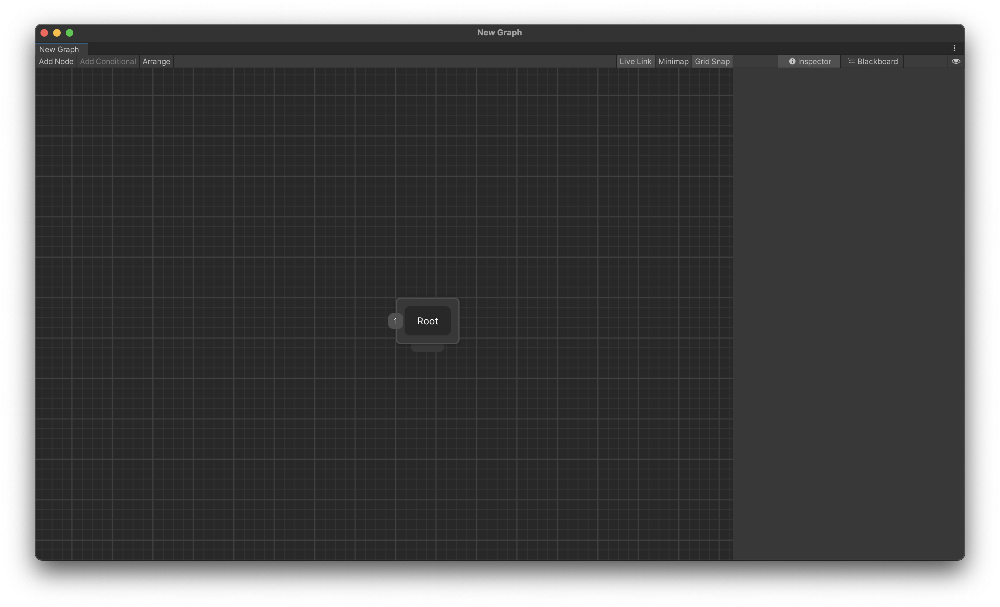
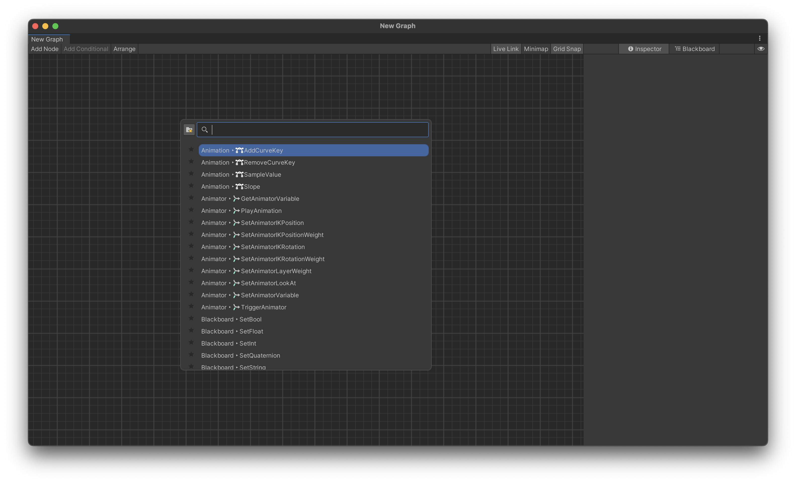
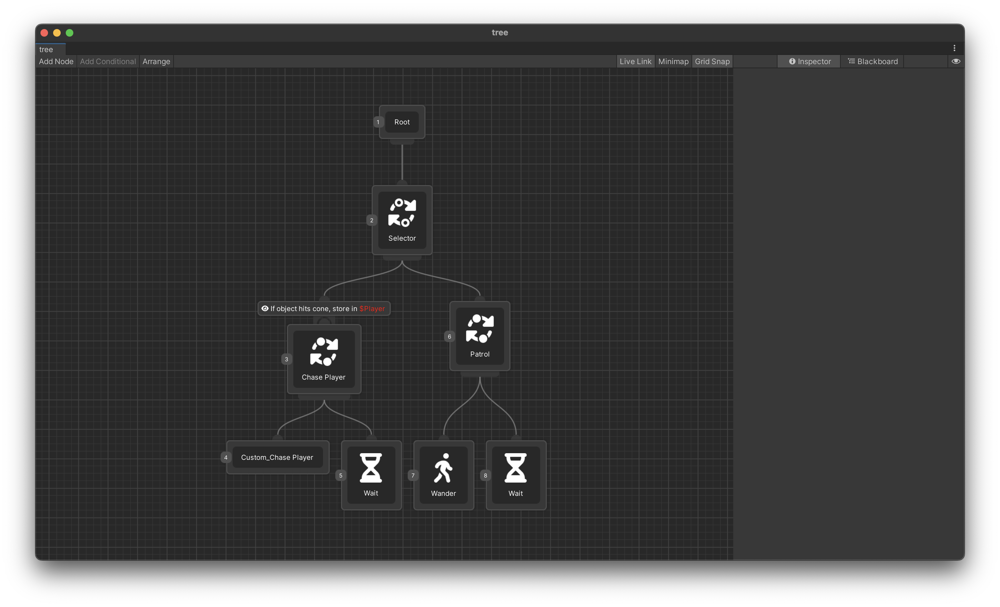

# Quick Start

Thanks for downloading Schema! With this tool, you can create Artificial Intelligence for video games, whether you are a programmer, artist, or designer. This guide is intended to let you hit the ground running creating behavior trees. All you need to know before creating your own trees are the basics, so let's get started.

When you first open Schema (accessed through `Window->AI->Behavior Editor` and clicking "New Graph") or by double-clicking a blank Schema behavior tree, you'll be greeted with this view.

Everything you'll need to create Behavior Trees is located in this window. In the center, you can see the grid view, where nodes and conditionals are located and connected to each other. This grid view is how the trees are built. At the top, you will see a toolbar that contains options and actions to create new nodes or conditionals, arrange the graph, and toggle UI elements. The right panel is the Inspector. It's function is practically identical to Unity's inspector. It will show important properties about the selected node or conditional, and gives you the ability to modify its properties. You may notice two tabs at the top. This is used to switch between the Inspector and Blackboard views. The blackboard is where you create variables for your behavior tree, so that you can pass data throughout and between behavior trees.

To add a node to the graph, simply right click and select `Add Node` from the menu, or press <kbd>Shift</kbd>+<kbd>A</kbd> on your keyboard. Upon doing so, you'll bring up a menu that allows you to search through all the available nodes. It automatically indexes new nodes, so any custom nodes that you may create will also appear in the search menu. To navigate between entries in the menu, use the arrow keys or scroll wheel.

When you've found a node to add to the tree, press <kbd>Enter</kbd> or click on it to add it to the tree. You can connect nodes to each other by grabbing the bottom connector and dragging it to the top connector of the other node. You can also do this in reverse, if you would like. If you accidentally bring up the Add Node menu, simply press escape or click out of it.

Once you've created you're tree, it may look a little messy. This is what the `Arrange` button is for. It automatically sorts all of the nodes so that they are each visible and distinguishable.

The actual tree is being created in a `.asset` file that you can move around freely. This file is integrated with Unity's save and load system, so any changes you make to the tree will be saved along with the rest of the project. If you don't save, you could lose work!

With the editor sorted out, let's discuss how behavior trees actually work.

Behavior trees are executed in a preorder manner, which is a way of sorting trees by how nodes are arranged in relation to one another. The number you see to the left of the node is its **priority**, and determines its execution order. Nodes wil be sorted top to bottom, left to right. In the tree above, for example, the engine will first execute the Root node, then the Selector node, then the Chase Player node (we'll get to the block on top later), etc.

There are three categories of nodes in Schema - the first is the **Root** node, where execution of the tree begins. Each node must be connected in some way to the root for them to be run. The root node can have only children, and no parents, since it is the first in the tree.

The second type of node is the **Flow** node, which like the name implies, determines the "Flow" of the behavior tree. For example, a Sequence node might execute each of its children until one of them fails.

The third and most important type of node is the **Action** node, which simply executes an action. It can be simple, like logging a message to the console, or more complex, such as chasing the player around a map. You can easily create custom actions for your tree to create behaviors that Schema doesn't include by default.

Schema uses an event driven behavior tree algorithm, which nets huge performance gains at the expense of some raw intuitiveness when creating behavior trees. In a traditional behavior tree, each node is traversed through every single frame, to finally get to the node that is currently running. In an event driven system, the currently running node is cached and returned to the next frame, which saves traversal throughout the whole tree. This means however, that the tree will not immediately react to changes in state. We have to "force" the tree to do things which can often be counterintuitive.

We use **Conditionals** to react to these changes, by aborting nodes if its condition changes. Event driven architecture is an advantage here, because you get more control over when the tree will change execution contexts.

We'll go into more depth about the details about behavior trees later.
