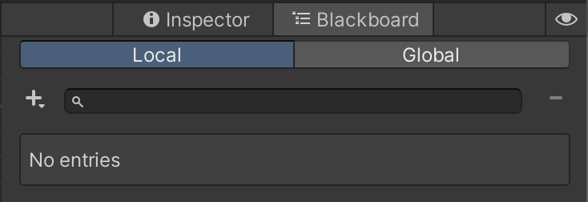

# The Blackboard

The blackboard is a simple way to add variables to your tree, and allows for both local and global variables.

Opening the "Blackboard" tab in the inspector panel, you will find a view similar to this:

This is where all of the variables, both local and global, are located for your tree. Global variables can be accessed through the second tab, and are stored by default in `Resources/GlobalBlackboard.asset`. Once this default asset is created, you can move it anywhere, so long as it is in a Resources folder.

To create a new variable, click the plus icon, where you can select the type that you would like to add. Clicking on an entry will also display a small editor at the bottom where you can change the name, type, and description for the entry.

You can also search through your entries using the top searchbar.
