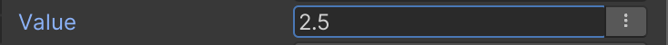

# Using the Blackboard

You can access blackboard entries through either the `BlackboardEntrySelector<T>` class or the non-generic `BlackboardEntrySelector`.

> **NOTE:** These classes are not available outside the tree, so don't attempt to use them in a MonoBehavior.

The generic `BlackboardEntrySelector<T>` class will display a field in the inspector that allows you to pick entries and enter a value if you don't want to source it from an entry.

For example, using a public `BlackboardEntrySelector<T>` field will display an inspector control like this:



You can enter any value in the field, or select a blackboard entry using the button to the right of the field. To access the value (either from the inspector or from a blackboard entry), use the `value` property on the object like so.

```csharp
public BlackboardEntrySelector<float> mySelector;
//...
Debug.Log(mySelector.value) // Writes 2.5
```

To set the value, simply set the `value` property. This will only change the underlying value if the selector is referencing a blackboard entry. Setting it otherwise will have no effect.

```csharp
mySelector.value = 10.0f;
Debug.Log(mySelector.value) // Writes 10.0
```

You can access the `inspectorValue` property to change the value as displayed in the editor, though this is not recommended as it will have global effects and will not change a per-tree variable like the blackboard would.

The non generic `BlackboardEntrySelector` class is a version of the selector in which you can add custom filters to the selector, without specifying a specific type. This version will not display an inspector field like the generic type, however. It will display a simple dropdown (like an enum) which you can then chose the entry to get or set values for.

To add one or more filters, call the `AddFilters` method on the object. This can be done at any time, though it is only useful in the editor, as that is when the user is selecting a entry.
